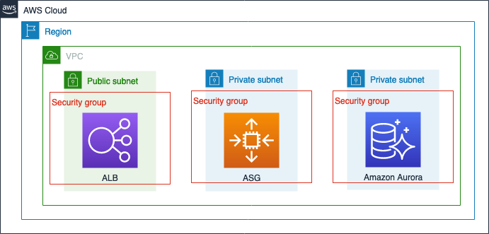
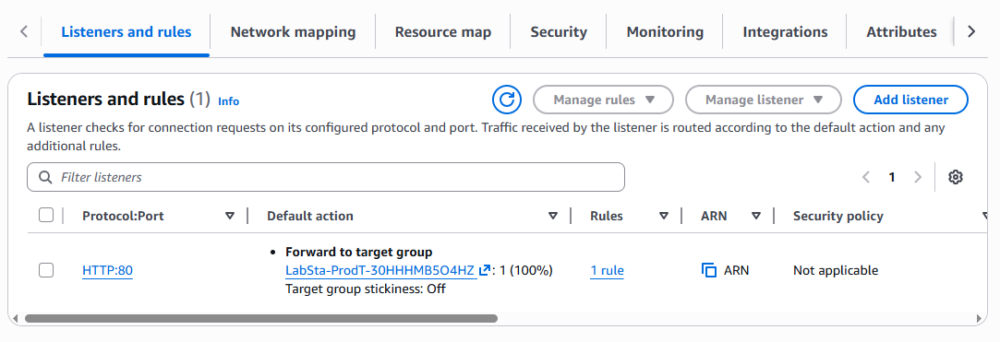
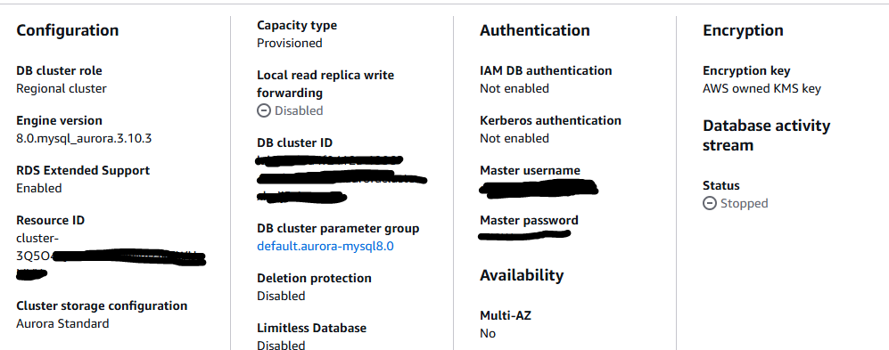

# AWS: Least Privilege Access with AWS IAM Roles

## Overview

Locked down AWS account access by building and attaching IAM policies to roles, enabling on-demand privilege escalation through role assumption and programmatic EC2 role assignment, eliminating standing permissions across user identities.

## Objectives

- Create IAM policies
- Attach the policies to existing roles
- Assume roles
- Revoke a session

## Architecture



---

## Task 1: Understanding the Architecture

A three-tier web application is running in the environment. It consists of an Application Load Balancer (ALB), an Auto Scaling group (ASG), and an Amazon Aurora database cluster that runs on Amazon RDS. Two user accounts have been created — one with administrator access, and one with only describe actions.

**Steps:**

1. Log in as `AdminUser`.
2. In the AWS Management Console, navigate to **IAM > Users**.
3. Select `IAMAdminUser` — notice the `AdministratorAccess` policy is attached directly to this user.
4. Select `IAMUser1` — this user has no administrator access and has restricted permissions.
5. In the left navigation, choose **Roles**. Four roles have been created:
   - A user read-only role
   - A user CRUD role
   - An Amazon EC2 read-only role
   - An Amazon EC2 CRUD role

   > **Note:** CRUD stands for "create, read, update, and delete."

6. Choose `UserReadOnlyRole` and examine its attached policy:

```json
{
    "Version": "2012-10-17",
    "Statement": [
        {
            "Action": [
                "ec2:DescribeRegions",
                "sts:AssumeRole"
            ],
            "Resource": "*",
            "Effect": "Allow"
        }
    ]
}
```

7. Navigate to **EC2 > Instances** — one instance is listed, a member of the ASG behind the ALB.
8. Navigate to **EC2 > Security Groups**, select `ASG-SG`, and review the **Inbound rules** tab.
9. Navigate to **EC2 > Load Balancers**, select the load balancer with `Prod` in its name, and review the **Listeners and rules** tab. The load balancer has one listener on port 80 forwarding to a target group.



10. Navigate to **RDS > Databases**, and choose the Amazon Aurora cluster.



The Amazon Aurora cluster has two endpoints configured for port 3306.

> ✅ **Task complete:** Successfully reviewed the architecture.

---

## Task 2: Creating Different Access Policies and Attaching Them to Roles

### Task 2.1: Create Policies

1. Navigate to **IAM > Policies > Create policy**.
2. Select **JSON** and replace the contents with the `ReadOnlyPolicy`:

```json
{
    "Version": "2012-10-17",
    "Statement": [
        {
            "Sid": "DescribeProd",
            "Effect": "Allow",
            "Action": [
                "ec2:Describe*",
                "sts:AssumeRole"
            ],
            "Resource": "*"
        }
    ]
}
```

3. Name it `ReadOnlyPolicy` and choose **Create policy**.
4. Repeat the process to create `CRUDPolicy`:

```json
{
    "Version": "2012-10-17",
    "Statement": [
        {
            "Sid": "ManageProd",
            "Effect": "Allow",
            "Action": [
                "ec2:AuthorizeSecurityGroupEgress",
                "ec2:AuthorizeSecurityGroupIngress",
                "ec2:Describe*",
                "ec2:RevokeSecurityGroupEgress",
                "ec2:RevokeSecurityGroupIngress",
                "ec2:StopInstances",
                "ec2:TerminateInstances",
                "ec2:UpdateSecurityGroupRuleDescriptionsEgress",
                "ec2:UpdateSecurityGroupRuleDescriptionsIngress",
                "rds:Describe*",
                "sts:AssumeRole"
            ],
            "Resource": "*"
        }
    ]
}
```

This policy allows basic Amazon EC2 CRUD and Amazon RDS read-only operations.

### Task 2.2: Attach Policies to Roles

1. Navigate to **IAM > Roles**.
2. Search for and select `UserReadOnlyRole`.
3. On the **Permissions** tab, choose **Add permissions > Attach policies**.
4. Find and select `ReadOnlyPolicy`, then choose **Add permissions**.
5. Repeat to attach `CRUDPolicy` to `UserCRUDRole`.

> ⚠️ **Caution:** Only add `CRUDPolicy` to `UserCRUDRole`. Do not add it to `UserReadOnlyRole`.

### Task 2.3: Update Trust Relationships for Roles

A trust relationship defines what entities are allowed to assume a role. Update the trust relationships for both `UserReadOnlyRole` and `UserCRUDRole`, limiting access to a single user.

1. Navigate to **IAM > Roles**, search for `UserReadOnlyRole`.
2. Choose the **Trust relationships** tab, then **Edit trust policy**.
3. Replace with the following (substituting your actual ARN):

```json
{
  "Version": "2012-10-17",
  "Statement": [
    {
      "Effect": "Allow",
      "Principal": {
        "AWS": "arn:aws:iam::483201xxxxxx:user/IAMUser1-xxxxxx"
      },
      "Action": "sts:AssumeRole"
    }
  ]
}
```

4. Choose **Update policy**.
5. Repeat for `UserCRUDRole`.

> ✅ **Task complete:** Successfully created different access policies and attached them to roles.

---

## Task 3: Assuming Roles

When an IAM user logs in, they are granted permissions based on policies directly attached to the user or to their groups. To increase security, a user can request short-term credentials that grant elevated permissions.

1. Log in as `IAMUser1` and navigate to **EC2 > Instances** — no instances are visible.
2. In the top-right corner, choose `IAMUser1-xxxxxx @` and select **Switch Role**.
3. Assume `UserReadOnlyRole` and choose **Switch Role**.
4. Navigate to **EC2 > Instances** — the Production web server is now visible (`ec2:Describe*` is permitted).
5. Attempt to terminate the instance — access is denied, confirming read-only scope.
6. Switch Role again and assume `UserCRUDRole`.
7. Verify elevated permissions by terminating the web server instance — this succeeds.

> ✅ **Task complete:** Successfully created policies, assigned them to roles, and assumed these roles to elevate privileges.

---

## Task 4: Revoking Sessions

This task demonstrates how to revoke session access for an assumed role — useful when credentials are suspected to be compromised.

1. Ensure `IAMUser1` is logged in and has assumed `UserCRUDRole`.
2. In a separate browser, log in as `IAMAdminUser`.
3. Navigate to **IAM > Roles > UserCRUDRole > Revoke sessions tab**.
4. Review the deny policy that will be applied:

```json
{
    "Version": "2012-10-17",
    "Statement": [
        {
            "Effect": "Deny",
            "Action": [
                "*"
            ],
            "Resource": [
                "*"
            ],
            "Condition": {
                "DateLessThan": {
                    "aws:TokenIssueTime": "[policy creation time]"
                }
            }
        }
    ]
}
```

5. Choose **Revoke active sessions**, acknowledge the dialog, and confirm.
6. IAM immediately attaches `AWSRevokeOlderSessions` to the role, denying all access to entities who assumed the role before the revocation moment.
7. Refresh the `IAMUser1` console — instances are no longer listed (credentials revoked).
8. Verify the `AdminUser` console still shows instances normally.

> ✅ **Task complete:** Successfully revoked session access for an assumed role.

---

## Assuming Roles Using the AWS CLI

1. Log in as `AdminUser`. Navigate to **EC2 > Instances**, select the Production Web Server, and choose **Actions > Connect > Session Manager**.

2. Update the terminal prompt and go to the home directory:

```bash
export PS1="\n[\u@\h \W] $ "
cd ~
```

3. Configure the AWS CLI:

```bash
aws configure
```

Enter the following:
```
AWS Access Key ID [None]: <ENTER>
AWS Secret Access Key [None]: <ENTER>
Default region name [None]: <paste your Region>
Default output format [None]: json
```

4. Determine the current role of the instance:

```bash
aws sts get-caller-identity
```

5. Attempt to describe RDS instances (this will fail — no access yet):

```bash
aws rds describe-db-instances \
  --query "DBInstances[*].[DBInstanceIdentifier, DBName, DBInstanceStatus, AvailabilityZone, DBInstanceClass]" \
  --output table
```

6. Create the IAM policy JSON file:

```bash
cat <<EOF >> ~/ec2ReadOnlyPolicy.json
{
    "Version": "2012-10-17",
    "Statement": [
        {
            "Effect": "Allow",
            "Action": [
                "ec2:Describe*",
                "rds:Describe*",
                "sts:AssumeRole"
            ],
            "Resource": "*"
        }
    ]
}
EOF
```

7. Create the policy and note the ARN in the output:

```bash
aws iam create-policy --policy-name ec2ReadOnlyPolicy --policy-document file://ec2ReadOnlyPolicy.json
# Output ARN: arn:aws:iam::<AccountId>:policy/ec2ReadOnlyPolicy
```

8. Retrieve the role name and account ID:

```bash
ec2ReadOnlyRole=$(aws iam list-roles --query 'Roles[*].[RoleName]' --output text | grep ec2ReadOnlyRole)
echo $ec2ReadOnlyRole

accountId=$(aws sts get-caller-identity --query 'Account' --output text)
echo $accountId
```

9. Attach the policy to the role:

```bash
aws iam attach-role-policy --role-name $ec2ReadOnlyRole --policy-arn <PolicyArn>
```

10. Retrieve the EC2 instance ID and update the trust relationship:

```bash
ec2InstanceId=$(aws ec2 describe-instances \
  --query 'Reservations[*].Instances[*].{Instance:InstanceId}' \
  --filters Name=instance-state-name,Values=running \
  --output text)
echo $ec2InstanceId
```

```bash
cat <<EOF >> ~/TrustRelationship.json
{
    "Version": "2012-10-17",
    "Statement": [
        {
            "Effect": "Allow",
            "Principal": {
                "AWS": [
                    "arn:aws:sts::$accountId:assumed-role/$ec2ReadOnlyRole/$ec2InstanceId",
                    "arn:aws:iam::$accountId:root"
                ]
            },
            "Action": "sts:AssumeRole"
        }
    ]
}
EOF
```

```bash
aws iam update-assume-role-policy --role-name $ec2ReadOnlyRole --policy-document file://TrustRelationship.json
```

11. Assume the role and capture credentials:

```bash
aws sts assume-role \
  --role-arn "arn:aws:iam::$accountId:role/$ec2ReadOnlyRole" \
  --role-session-name AWSCLI-Session
```

12. Export the credentials from the output:

```bash
export AWS_SECRET_ACCESS_KEY=<SecretAccessKey>
export AWS_SESSION_TOKEN=<SessionToken>
export AWS_ACCESS_KEY_ID=<AccessKeyId>
```

13. Verify the assumed role:

```bash
aws sts get-caller-identity
# Output confirms ec2ReadOnlyRole is active
```

14. Verify RDS access now works:

```bash
aws rds describe-db-instances \
  --query "DBInstances[*].[DBInstanceIdentifier, DBName, DBInstanceStatus, AvailabilityZone, DBInstanceClass]" \
  --output table
```

15. Switch back to the original role:

```bash
unset AWS_ACCESS_KEY_ID AWS_SECRET_ACCESS_KEY AWS_SESSION_TOKEN
aws sts get-caller-identity
```

---

## Conclusion

- Created access policies (`ReadOnlyPolicy`, `CRUDPolicy`, `ec2ReadOnlyPolicy`)
- Attached policies to roles (`UserReadOnlyRole`, `UserCRUDRole`, `ec2ReadOnlyRole`)
- Assumed roles and verified access elevation
- Revoked active sessions for a compromised role

---

## Additional Resources

To read more about revoking sessions, see [Revoking IAM Role Temporary Security Credentials](https://docs.aws.amazon.com/IAM/latest/UserGuide/id_roles_use_revoke-sessions.html).

1.
