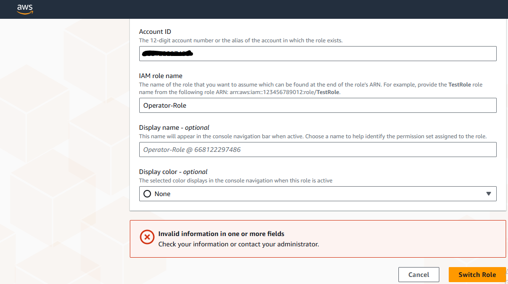
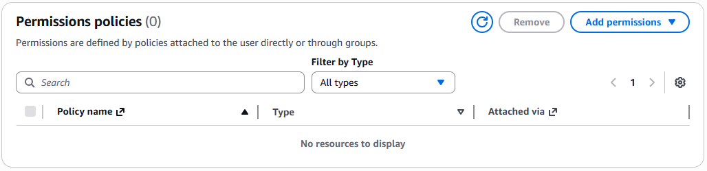
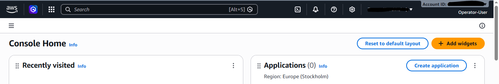
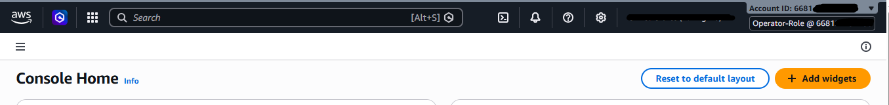

# AWS: Troubleshooting IAM Access Issues

## Overview

Resolved a broken role-switch workflow in a break/fix scenario by auditing and correcting both the user's identity-based policy and the IAM role trust policy, restoring access while enforcing least privilege principles.

---

## Objectives

- View and update IAM permissions of a user identity-based policy to allow the user to assume an IAM role.
- View and update IAM role trust policy to allow a user to assume an IAM role.
- Apply least privilege concepts.
- Verify the solution.

---

## Architecture


**Architecture components:**

- An IAM user named **Operator-User**.
- An IAM role named **Operator-Role** which needs to be assumed by the Operator-User.
- An Amazon EC2 instance named **CommandHost**.
- **Session Manager**, a capability of AWS Systems Manager, to allow connecting to the EC2 instance.
- An IAM user **AWSLabUser** — used to log in to the console to troubleshoot and fix the issue.

---

## Project Scenario

A new user **Operator-User** is starting in the company and needs access to AWS. The user has been given access to the console with the following instructions to perform their duties:

1. Login to the AWS Management Console with the provided Operator-User credentials.
2. Switch to an IAM role (assume role) named **Operator-Role** using the AWS Management Console.
3. Once the role is assumed, start a Systems Manager session to connect to the **CommandHost** instance.
4. Run required scripts from the CommandHost prompt.

**The Problem:** Operator-User is logging into the AWS Management Console but failing to assume the assigned IAM role, and is therefore unable to perform their duties. The task is to troubleshoot and fix this issue while applying least privilege concepts.

---

## Task 1: Accessing the Lab

1. Open a new **Private / Incognito / InPrivate** browser window.
2. Sign in as **Operator-User**.
3. Attempt to assume the **Operator-Role** IAM role from the AWS Management Console to verify the user issue.
4. At the upper-right corner of the page, choose the **Operator-User** drop-down menu, then choose **Switch role**.



---

## Task 2: Troubleshooting, Remediating, and Verifying

The **AWSLabUser** has the required permissions to solve the issue.

### Constraints (Least Privilege)

The solution must strictly adhere to the following least privilege guidelines:

- The **Operator-User** has permissions to **only** assume the **Operator-Role**.
- The **Operator-Role** can **only** be assumed by the **Operator-User**.

### Background: How IAM Role Assumption Works

There are two conditions that must both be true for a role assumption to succeed:

1. The IAM entity (Operator-User) must have permissions to assume the role in its **identity-based policy**.
2. The IAM role (Operator-Role) **trust policy** must allow the Operator-User to assume the role.

---

### Step 1: Check the Operator-User's Permissions

1. Switch to the AWS Management Console tab logged in as **AWSLabUser**.
2. In the search bar, search for and choose **IAM**.
3. In the left navigation pane, under **Access management**, choose **Users**.
4. Choose the link for **Operator-User**.
5. Under the **Permissions** tab, check the available Permissions policies.

> **Finding:** There are no policies attached to the Operator-User.



---

### Step 2: Create and Attach an Identity-Based Policy

1. In the left navigation pane, choose **Policies**.
2. Choose **Create policy**.
3. Set the policy name to `IAM-User-Policy`.
4. Under the **JSON editor**, enter the following policy:

```json
{
    "Version": "2012-10-17",
    "Statement": {
        "Action": "sts:AssumeRole",
        "Resource": "arn:aws:iam::668122297486:role/Operator-Role",
        "Effect": "Allow",
        "Sid": "AssumeRole"
    }
}
```

5. From the **Actions** drop-down menu, select **Attach**.
6. Locate and select **Operator-User**.
7. Choose **Attach policy**.

> The Operator-User now has permissions to assume the Operator-Role.

---

### Step 3: Check and Update the Operator-Role Trust Policy

1. In the left navigation pane, choose **Roles**.
2. Locate and choose **Operator-Role**.
3. Choose the **Trust relationships** tab.

> **Finding:** The current trust policy has the following principal:

```json
{
    "Version": "2012-10-17",
    "Statement": [
        {
            "Effect": "Allow",
            "Principal": {
                "Service": "ec2.amazonaws.com"
            },
            "Action": "sts:AssumeRole"
        }
    ]
}
```

The `Principal` is set to `ec2.amazonaws.com` (the EC2 service), not the Operator-User. This is the root cause of the issue — the trust policy does not permit the Operator-User to assume the role.

---

### Step 4: Update the Trust Policy

1. Choose **Edit trust policy**.
2. Delete the existing policy.
3. Enter the following updated trust policy:

```json
{
    "Version": "2012-10-17",
    "Statement": [
        {
            "Effect": "Allow",
            "Principal": {
                "AWS": "arn:aws:iam::668122xxxxxx:user/Operator-User"
            },
            "Action": "sts:AssumeRole"
        }
    ]
}
```

> The trust policy now allows **only** the Operator-User to assume the Operator-Role.

---

### Step 5: Verify the Solution

1. Switch to the AWS Management Console tab logged in as **Operator-User**.
2. At the upper-right corner, choose the **Operator-User** drop-down menu, then choose **Switch role**.



3. On the **Switch Role** page:
   - For **Account**, enter the Account ID.
   - For **Role**, enter `Operator-Role`.
   - Choose **Switch Role**.

4. If the solution is correct, you are redirected to the Console Home page and the logged entity shown at the upper-right corner is now **Operator-Role**.



> **Success:** The issue is resolved. The Operator-User can now assume the Operator-Role.

---

## Conclusion

- ✅ Viewed and updated IAM permissions of a user identity-based policy to allow the user to assume an IAM role.
- ✅ Viewed and updated IAM role trust policy to allow a user to assume an IAM role.
- ✅ Verified the solution by successfully assuming the role.

---

## Additional Resources

- [**Using IAM roles**](https://docs.aws.amazon.com/IAM/latest/UserGuide/id_roles_use.html)
- [**Troubleshooting IAM roles**](https://docs.aws.amazon.com/IAM/latest/UserGuide/troubleshoot_roles.html)
- [**How to use trust policies with IAM roles**](https://aws.amazon.com/blogs/security/how-to-use-trust-policies-with-iam-roles/)
