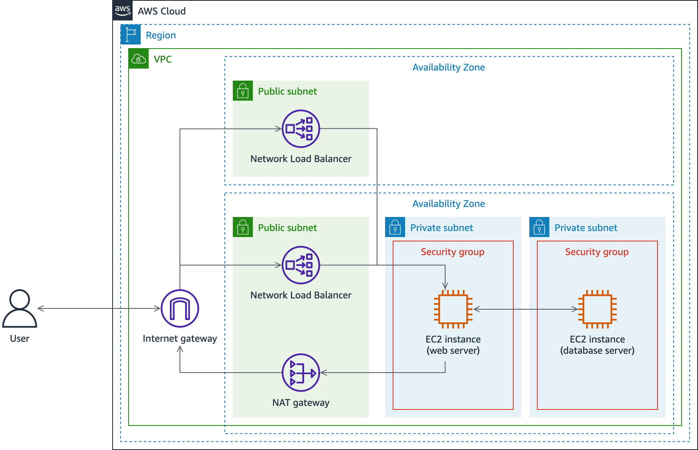

# AWS: Implementing and Controlling Network Traffic on AWS

## Overview

Built a three-tier security zone network on Amazon VPC using public/private subnets, security groups, and NACLs, then validated traffic isolation between zones using VPC flow log analysis.

---

## Objectives

- Create a three-security zone network infrastructure
- Implement network segmentation using security groups, network ACLs, and public and private subnets
- Monitor network traffic to EC2 instances using VPC flow logs

---

## Architecture



> The diagram depicts the data flow from an external user to an internet gateway, through a Network Load Balancer in a public subnet, to a web server in a private subnet, to a database server in a separate private subnet.

**Major resources in the architecture:**

- A VPC with one public subnet and two private subnets in one Availability Zone, and one public subnet in a second Availability Zone
- A Network Load Balancer with two nodes, one in each public subnet
- An EC2 instance acting as a web server in the first private subnet
- An EC2 instance acting as a database server in the second private subnet
- Two security groups, one for each instance based on its purpose
- Network traffic flows from an external user, through an internet gateway, to one of the two Network Load Balancer nodes, to the web server. If the WordPress blog site URL is requested, traffic flows to the database server as well

---

## Task 1: Restrict Network Traffic Using Security Groups

Used security groups for each resource type to control the traffic allowed to flow between them.

### Task 1.1: Verify Current Connectivity State

Verified ability to access the web server.

**Output:** The connection timed out after approximately 1 minute with an error stating the page could not be reached. No security group rules existed to allow traffic to pass from the load balancer to the web server.


---

### Task 1.2: Allow HTTPS Traffic to the Web Server

1. In the AWS Management Console, search for and choose **EC2**
2. Under **Network & Security**, choose **Security Groups**
3. Select the **Web Server SG** security group
4. In the Details pane, choose the **Inbound rules** tab → **Edit inbound rules** → **Add rule**
5. Configure the new rule:
   - **Type:** HTTPS
   - **Source:** Anywhere-IPv4 (`0.0.0.0/0`)
   - **Description:** Allow HTTPS traffic from any source
6. Choose **Save rules**

> **Note:** This rule allows inbound traffic on port 443 to any resource in the WebServerSG security group from any IPv4 source IP. Because this project uses a Network Load Balancer to pass traffic directly to the web server, HTTPS connections must be allowed from any source.


---

### Task 1.3: Verify Traffic Flow to the Web Server

Verified the rules added to the security group allow access to the web server.

> **Note:** The web server uses a self-signed SSL certificate. If the browser warns of a potential security risk, choose to continue to the site.

**Expected output:** An Apache HTTP server test page loads.


After confirming web server access over HTTPS, attempting to access the WordPress site resulted in a **Gateway Timeout** error after approximately 1 minute. WordPress hosts the web page on one instance and its database on a different instance in a separate private subnet. No security group rules existed to allow traffic from the web server EC2 instance to the database server EC2 instance.

---

### Task 1.4: Allow Traffic from the Web Server to the Database Server

**Step 1 — Add outbound rule to Web Server SG:**

1. On the **Security Groups** page, select **Web Server SG**
2. Choose the **Outbound rules** tab → **Edit outbound rules** → **Add rule**
3. Configure the new rule:
   - **Type:** MYSQL/Aurora *(Protocol: TCP, Port: 3306 auto-populated)*
   - **Destination:** Custom → `DatabaseServerSG`
   - **Description:** Allow MYSQL database traffic to resources in the DatabaseServerSG security group
4. Choose **Save rules**


**Step 2 — Add inbound rule to Database Server SG:**

1. On the **Security Groups** page, select **Database Server SG**
2. Choose the **Inbound rules** tab → **Edit inbound rules** → **Add rule**
3. Configure the new rule:
   - **Type:** MYSQL/Aurora (3306)
   - **Source:** Custom → `WebServerSG`
   - **Description:** Allow MYSQL database traffic from resources in the WebServerSG security group
4. Choose **Save rules**


---

### Task 1.5: Verify Traffic Flow to the Database Server and Configure WordPress

With security group rules in place to allow traffic to flow to the database server:

**Expected output:** The WordPress welcome page loads.


**Task 1 Complete:** Successfully added security group rules to allow only the appropriate traffic to connect to the WordPress site hosted in the private subnet.

---

## Task 2: Restrict Traffic to the Public Subnet

Modified the network access control lists (ACLs) for each subnet to allow only the traffic required for website access to pass through at the subnet level.

---

### Task 2.1: Create Network ACL Rules for the Load Balancer Subnets

1. In the AWS Management Console, search for and choose **VPC**
2. Under **Security**, choose **Network ACLs** → **Create network ACL**
3. Configure:
   - **Name:** `load-balancer-nacl`
   - **VPC:** Project VPC
4. Select **load-balancer-nacl** → **Subnet associations** tab → **Edit subnet associations**
   - Select **Load Balancer Subnet 1 (Public)**
   - Select **Load Balancer Subnet 2 (Public)**
   - Choose **Save changes**

**Inbound rules:**

| Rule # | Type        | Protocol | Port Range  | Source          | Allow/Deny |
|--------|-------------|----------|-------------|-----------------|------------|
| 100    | HTTPS       | TCP      | 443         | 0.0.0.0/0       | Allow      |
| 101    | Custom TCP  | TCP      | 1024–65535  | 10.10.0.0/16    | Allow      |

> **Learn more:** Rule 101 allows inbound connections on ephemeral ports from any resource within the project VPC. Devices temporarily use ephemeral ports to initiate a connection. After the initial connection is made, traffic is then allowed to propagate on the required port (e.g., HTTPS port 443). See [Ephemeral ports](#additional-resources).

**Outbound rules:**

| Rule # | Type        | Protocol | Port Range  | Destination      | Allow/Deny |
|--------|-------------|----------|-------------|------------------|------------|
| 100    | HTTPS       | TCP      | 443         | 10.10.10.0/24    | Allow      |
| 101    | Custom TCP  | TCP      | 1024–65535  | 0.0.0.0/0        | Allow      |

> **Learn more:** For recommended traffic rules for a load balancer, refer to [Network ACLs for load balancers in a VPC](#additional-resources).

---

### Task 2.2: Create Network ACL Rules for the Web Server Subnet

- **Name:** `web-server-nacl`
- **VPC:** Project VPC
- **Subnet associations:** Web Server Subnet (Private)

**Inbound rules:**

| Rule # | Type       | Protocol | Port Range | Source        | Allow/Deny |
|--------|------------|----------|------------|---------------|------------|
| 100    | HTTPS      | TCP      | 443        | 0.0.0.0/0     | Allow      |
| 101    | Custom TCP | TCP      | 1024–65535 | 10.10.0.0/16  | Allow      |

**Outbound rules:**

| Rule # | Type          | Protocol | Port Range | Destination    | Allow/Deny |
|--------|---------------|----------|------------|----------------|------------|
| 100    | Custom TCP    | TCP      | 1024–65535 | 0.0.0.0/0      | Allow      |
| 101    | MYSQL/Aurora  | TCP      | 3306       | 10.10.20.0/24  | Allow      |

---

### Task 2.3: Verify Traffic Flow to the Web Server

Verified the network ACL rules allow access to the web server.

**Expected output:** An Apache HTTP server test page loads.

---

### Task 2.4: Create Network ACL Rules for the Database Server Subnet

- **Name:** `database-server-nacl`
- **VPC:** Project VPC
- **Subnet associations:** Database Server Subnet (Private)

**Inbound rules:**

| Rule # | Type          | Protocol | Port Range | Source          | Allow/Deny |
|--------|---------------|----------|------------|-----------------|------------|
| 100    | MYSQL/Aurora  | TCP      | 3306       | 10.10.10.0/24   | Allow      |
| 101    | Custom TCP    | TCP      | 1024–65535 | 10.10.0.0/16    | Allow      |

**Outbound rules:**

| Rule # | Type       | Protocol | Port Range | Destination   | Allow/Deny |
|--------|------------|----------|------------|---------------|------------|
| 100    | Custom TCP | TCP      | 1024–65535 | 10.10.0.0/16  | Allow      |

---

### Task 2.5: Verify Traffic Flow to the Database Server

Verified the network ACL rules allow access to the WordPress blog site.

**Expected output:** The WordPress blog page loads.

**Task 2 Complete:** Successfully created network ACL rules to limit inbound and outbound traffic to only what is required to access the blog site.

---

## Task 3: Inspect Network Traffic with VPC Flow Logs

Created VPC flow logs to send network traffic data to Amazon CloudWatch. Analyzed the logs to confirm which types of traffic are allowed and which are rejected.

---

### Task 3.1: Create the CloudWatch Log Group

1. In the AWS Management Console, search for and choose **CloudWatch**
2. In the navigation pane, under **Logs**, choose **Log Management**
3. On the **Log groups** tab, choose **Create log group**
4. Configure:
   - **Log group name:** `blog-access-logs`
   - **Retention setting:** 1 day
5. Choose **Create**

> **Note:** Logs are retained for only 1 day for the duration of this project.

---

### Task 3.2: Create a VPC Flow Log

1. In the AWS Management Console, search for and choose **VPC**
2. Under **Virtual private cloud**, choose **Your VPCs**
3. Select **Project VPC** → **Flow logs** tab → **Create flow log**
4. Configure:
   - **Name:** `vpc-flow-logs-for-blog`
   - **Filter:** All
   - **Maximum aggregation interval:** 1 minute
   - **Destination:** Send to CloudWatch Logs
   - **Destination log group:** `blog-access-logs`
   - **Service role:** `VpcFlowLogsRole`
   - **Log record format:** Custom format
5. Select the following log format fields in order:
   - `account-id`, `interface-id`, `srcaddr`, `srcport`, `dstaddr`, `dstport`, `subnet-id`, `flow-direction`, `action`

**Expected format preview:**
```
${account-id} ${interface-id} ${srcaddr} ${srcport} ${dstaddr} ${dstport} ${subnet-id} ${flow-direction} ${action}
```

6. Choose **Create flow log**

**IAM Policy attached to `VpcFlowLogsRole`:**

```json
{
  "Version": "2012-10-17",
  "Statement": [
    {
      "Action": [
        "logs:CreateLogGroup",
        "logs:CreateLogStream",
        "logs:PutLogEvents",
        "logs:DescribeLogGroups",
        "logs:DescribeLogStreams"
      ],
      "Resource": "*",
      "Effect": "Allow"
    }
  ]
}
```

> This policy allows the VPC Flow Logs service to create CloudWatch log groups and log streams, and write events to the log streams.

---

### Task 3.3: Generate Traffic and Analyze Logs

1. Visit the WordPress blog site to generate traffic to the web and database servers
2. Refresh the page three times to generate additional traffic
3. Update the URL to `http://` and attempt to access the blog site again (to generate rejected traffic)
4. In **CloudWatch** → **Log Management** → **Log groups**, select `blog-access-logs`
5. Choose **Search all log streams** to review log entries
6. Use the expand arrow to view the full message for each log entry and determine which traffic was allowed vs. rejected


**Task 3 Complete:** Successfully created VPC Flow Logs to monitor network traffic within the VPC.

---

## Conclusion

- Created a three-security zone network infrastructure
- Implemented network segmentation using security groups, network ACLs, and public and private subnets
- Monitored network traffic to EC2 instances using VPC flow logs

---

## Additional Resources

- [Elastic Load Balancing product comparisons](https://aws.amazon.com/elasticloadbalancing/features/)
- [Ephemeral ports](https://docs.aws.amazon.com/vpc/latest/userguide/vpc-network-acls.html#nacl-ephemeral-ports)
- [Network ACLs for load balancers in a VPC](https://docs.aws.amazon.com/vpc/latest/userguide/vpc-network-acls.html#nacl-rules-scenario)
- [Aggregation interval](https://docs.aws.amazon.com/vpc/latest/userguide/flow-logs.html#flow-logs-basics)
- [Logging IP traffic with VPC Flow Logs](https://docs.aws.amazon.com/vpc/latest/userguide/flow-logs.html)
- [Publish flow logs to CloudWatch Logs](https://docs.aws.amazon.com/vpc/latest/userguide/flow-logs-cwl.html)
