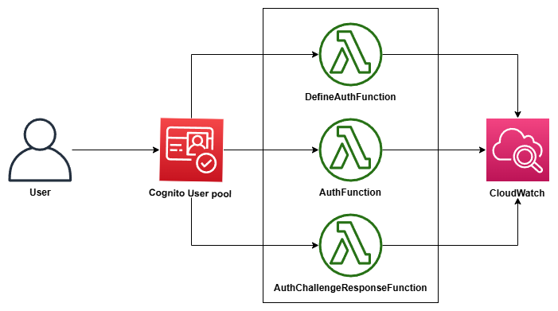

# AWS: Implement Custom Authentication with Amazon Cognito

## Overview

This project introduces Amazon Cognito's custom authentication flow, focusing on creating and implementing a secure user authentication process. It emphasizes hands-on experience with Lambda functions, user pools, and integration with CloudWatch for event logging.

## Architecture



## Objectives

- Configure Amazon Cognito user pool.
- Implement Lambda functions for authentication flow.
- Test the custom authentication flow.
- Configure event logging in CloudWatch.

## Description

This project demonstrates a serverless custom authentication implementation using Amazon Cognito. When a user attempts to authenticate, Amazon Cognito orchestrates the flow through three Lambda functions:

- **DefineAuthFunction** – Initiates the challenge.
- **AuthFunction** – Generates a verification code.
- **AuthChallengeResponseFunction** – Validates the user response.

All function activities are logged to CloudWatch for verification.

## Services Used

- Amazon Cognito
- AWS Lambda
- Amazon CloudWatch

---

## Task 1: Configure an Amazon Cognito User Pool

1. At the top of the AWS Management Console, search for **Cognito** and choose that service.
2. Choose **User pools** → **Create user pool**.
3. For **Define your application**, select **Single-page application (SPA)**.
4. In the **Name your application** section, enter `CustomAuthApp`.
5. In the **Configure options** section, select **Email**.
6. For **Required attributes for sign-up**, select `email`.
7. Choose **Create user directory**.
8. Navigate back to **User pools** and select the newly created pool.
9. Choose **Rename**, enter `custom_app`, and choose **Save changes**.
   > ✅ **Expected output:** `User pool name has been updated successfully.`
10. Under **Authentication → Sign-in**, ensure MFA enforcement is set to **No MFA**.
11. Under **User account recovery**, select **Edit** → set delivery method to **Email only** → **Save changes**.
12. Under **Authentication → Authentication methods**, navigate to **Password policy** → **Edit**.
13. Set the password policy mode to **Custom** and select only:
    - Contains at least 1 number
    - Contains at least 1 lowercase letter
14. Choose **Save changes**.
    > ✅ **Expected output:** `Password policy has been updated successfully.`

---

## Task 2: Add Lambda Triggers for Custom Authentication

The custom authentication flow uses three Lambda triggers that work together in sequence:

| Order | Trigger | Description |
|-------|---------|-------------|
| 1st | **DefineAuthChallenge** | Triggers when a user attempts to authenticate |
| 2nd | **CreateAuthChallenge** | Requests a custom challenge and its answer |
| 3rd | **VerifyAuthChallengeResponse** | Compares the user answer to the expected answer |

### Task 2.1: Configure DefineAuthChallenge Lambda Trigger

1. From the left pane, under **Authentication**, select **Extensions** → **Add Lambda trigger**.
2. For **Trigger type**, select **Custom authentication** → **Define auth challenge**.
3. For **Lambda function**, select **Create Lambda function**.
4. Choose **Create function**, enter `DefineAuthFunction` as the function name, and select **Python 3.13** as the runtime.
5. Under **Change default execution role**, choose **Use an existing role** → select `CognitoLambdaRole`.
6. Choose **Create function**.
7. In the **Function code** section, replace the existing code with the following:

```python
def lambda_handler(event, context):
    """
    Determines the next challenge in the authentication flow.
    """
    try:
        # Log the incoming event (useful for debugging)
        print("DefineAuthChallenge event:", event)

        if event['triggerSource'] == 'DefineAuthChallenge_Authentication':
            session = event['request'].get('session', [])

            # First authentication attempt
            if len(session) == 0:
                event['response'] = {
                    'challengeName': 'CUSTOM_CHALLENGE',
                    'failAuthentication': False,
                    'issueTokens': False
                }
                print("Starting custom authentication challenge")

            # Check if the user successfully completed the challenge
            elif len(session) == 1 and session[0].get('challengeResult', False):
                event['response'] = {
                    'failAuthentication': False,
                    'issueTokens': True
                }
                print("Challenge passed, issuing tokens")

            # Handle failed or invalid attempts
            else:
                event['response'] = {
                    'failAuthentication': True,
                    'issueTokens': False
                }
                print("Challenge failed, denying authentication")

        return event

    except Exception as e:
        print(f"Error in DefineAuthChallenge: {str(e)}")
        raise e
```

This Lambda function handles the initial authentication request. It:
- Initiates the custom challenge flow on the first attempt.
- Issues tokens if the challenge is passed.
- Denies authentication if the challenge fails.

8. Choose **Deploy**.
   > ✅ **Expected output:** `Successfully updated the function DefineAuthFunction.`
9. Return to the Cognito trigger setup page, refresh the function list, select `DefineAuthFunction`, and choose **Add Lambda trigger**.

---

### Task 2.2: Configure AuthChallenge Lambda Trigger

1. From the left pane, under **Authentication**, select **Extensions** → **Add Lambda trigger**.
2. For **Trigger type**, select **Custom authentication** → **Create auth challenge**.
3. For **Lambda function**, select **Create Lambda function**.
4. Enter `AuthFunction` as the function name, select **Python 3.13**, and assign the `CognitoLambdaRole`.
5. Choose **Create function**.
6. Replace the existing code with the following:

```python
import random
import string
import logging
import json
from datetime import datetime

logger = logging.getLogger()
logger.setLevel(logging.INFO)

def generate_code():
    """Generate a random 6-digit verification code"""
    return ''.join(random.choices(string.digits, k=6))

def lambda_handler(event, context):
    """
    Creates a custom authentication challenge.
    """
    logger.info("Triggers received: %s", json.dumps(event))

    try:
        if event['triggerSource'] == 'CreateAuthChallenge_Authentication':
            challenge_code = generate_code()
            username = event['request']['userAttributes'].get('email', 'unknown user')

            event['response'] = {
                'publicChallengeParameters': {
                    'message': 'Please enter the following code: ' + challenge_code
                },
                'privateChallengeParameters': {
                    'answer': challenge_code,
                    'timestamp': str(datetime.utcnow())
                }
            }

            logger.info(f"Created challenge for user: {username}")
            logger.info(f"Challenge code (remove in production): {challenge_code}")

        return event

    except Exception as e:
        logger.error(f"Error in CreateAuthChallenge: {str(e)}")
        raise e
```

This Lambda function generates a random 6-digit verification code, creates public challenge parameters for user display, and stores private challenge parameters for verification.

7. Choose **Deploy**.
   > ✅ **Expected output:** `Successfully updated the function AuthFunction.`
8. Return to the Cognito trigger setup page, refresh the function list, select `AuthFunction`, and choose **Add Lambda trigger**.

---

### Task 2.3: Configure AuthChallengeResponse Lambda Trigger

1. From the left pane, under **Authentication**, select **Extensions** → **Add Lambda trigger**.
2. For **Trigger type**, select **Custom authentication** → **Verify auth challenge response**.
3. For **Lambda function**, select **Create Lambda function**.
4. Enter `AuthChallengeResponseFunction` as the function name, select **Python 3.13**, and assign the `CognitoLambdaRole`.
5. Choose **Create function**.
6. Replace the existing code with the following:

```python
import logging
import json

logger = logging.getLogger()
logger.setLevel(logging.INFO)

def lambda_handler(event, context):
    """
    Verifies the response to the custom authentication challenge.
    """
    try:
        logger.info("VerifyAuthChallenge event: %s", json.dumps(event))

        if event['triggerSource'] == 'VerifyAuthChallengeResponse_Authentication':
            challenge_answer = event['request'].get('challengeAnswer', '')
            expected_answer = event['request']['privateChallengeParameters'].get('answer', '')

            is_correct = challenge_answer == expected_answer

            event['response'] = {
                'answerCorrect': is_correct
            }

            logger.info(f"Challenge verification result: {is_correct}")
            if not is_correct:
                logger.info("Invalid answer provided")

        return event

    except Exception as e:
        logger.error(f"Error in VerifyAuthChallenge: {str(e)}")
        raise e
```

This Lambda function compares the user's challenge answer against the stored private parameters and returns a boolean verification result (`True`/`False`), logging the authentication outcome.

7. Choose **Deploy**.
   > ✅ **Expected output:** `Successfully updated the function AuthChallengeResponseFunction.`
8. Return to the Cognito trigger setup page, refresh the function list, select `AuthChallengeResponseFunction`, and choose **Add Lambda trigger**.

> **Note:** The Lambda functions are invoked during the custom authentication flow in this order: `DefineAuthChallenge` → `AuthChallenge` → `AuthChallengeResponse`.

> ✅ **Task complete:** You have successfully created three Lambda triggers for the custom authentication flow.

---

## Task 3: Create a Test User for the Amazon Cognito User Pool

1. Navigate to the Amazon Cognito console.
2. In the left navigation pane, under **User management**, choose **Users** → **Create user**.
3. Configure the following:
   - **Invitation message:** Don't send an invitation
   - **Email address:** `xxxx@example.com`
   - Check **Mark email address as verified**
   - **Temporary password:** Set a password → enter a password
4. Choose **Create user**.

> ✅ **Task complete:** You have successfully created a test user to validate the custom authentication flow.

---

## Task 4: Validate the Custom Authentication Flow Using CloudWatch Logs

### Task 4.1: Test the DefineAuthFunction

1. In the AWS Lambda console, open **DefineAuthFunction**.
2. Choose the **Test** tab and use the following JSON test event:

```json
{
  "triggerSource": "DefineAuthChallenge_Authentication",
  "request": {
    "session": []
  },
  "response": {}
}
```

3. Choose **Test**.
   > ✅ **Expected output:** `Executing function: succeeded`

4. Open the CloudWatch log stream and expand the `START` message to verify output:

```
START RequestId: 81ddb0fb-70fe-454e-bfce-c1fef43680a7 Version: $LATEST

DefineAuthChallenge event: {'triggerSource': 'DefineAuthChallenge_Authentication', 'request': {'session': []}, 'response': {}}

Starting custom authentication challenge
```

---

### Task 4.2: Test the AuthFunction

1. In the AWS Lambda console, open **AuthFunction**.
2. Choose the **Test** tab and use the following JSON test event:

```json
{
  "triggerSource": "CreateAuthChallenge_Authentication",
  "request": {
    "userAttributes": {
      "email": "xxxx@example.com"
    }
  },
  "response": {}
}
```

3. Choose **Test**.
   > ✅ **Expected output:** `Executing function: succeeded`

4. Open the CloudWatch log stream. Example output:

```
START RequestId: 95d9a456-1c21-4e5c-88db-29a7336975a5 Version: $LATEST

[INFO] Triggers received: { "triggerSource": "CreateAuthChallenge_Authentication", ... }

[INFO] Created challenge for user: xxxx@example.com

[INFO] Challenge code (remove in production): 760759

END RequestId: 95d9a456-1c21-4e5c-88db-29a7336975a5
```

5. **Copy the 6-digit challenge code** from the logs — you will need it in the next step.

> ⚠️ **Caution:** Use the correct challenge code. An incorrect code will cause the next function test to fail.

---

### Task 4.3: Test the AuthChallengeResponseFunction

1. In the AWS Lambda console, open **AuthChallengeResponseFunction**.
2. Choose the **Test** tab and use the following JSON test event, replacing `CHALLENGE_CODE` with the code from the previous task:

```json
{
  "triggerSource": "VerifyAuthChallengeResponse_Authentication",
  "request": {
    "challengeAnswer": "CHALLENGE_CODE",
    "privateChallengeParameters": {
      "answer": "CHALLENGE_CODE"
    }
  },
  "response": {}
}
```

3. Choose **Test**.
   > ✅ **Expected output:** `Executing function: succeeded`

4. Open the CloudWatch log stream. Example output:

```
START RequestId: 1897edda-2378-4a8f-a230-9b43b57c08e8 Version: $LATEST

[INFO] VerifyAuthChallenge event: { "triggerSource": "VerifyAuthChallengeResponse_Authentication", ... }

[INFO] Challenge verification result: True

END RequestId: 1897edda-2378-4a8f-a230-9b43b57c08e8
```

A result of `True` confirms the challenge code entered matches the one generated by `AuthFunction`, completing the authentication flow.

> ✅ **Task complete:** You have successfully validated the custom authentication flow by testing all three Lambda triggers and reviewing CloudWatch logs.

---

## Conclusion

In this project, you:

- Configured an Amazon Cognito user pool.
- Implemented Lambda functions for a custom authentication flow.
- Tested the custom authentication flow end-to-end.
- Configured event logging in CloudWatch.

---

## Additional Resources

- For more information about Amazon Cognito authentication flows, see [Amazon Cognito Documentation](https://docs.aws.amazon.com/cognito/).
- For more information about how to use AWS Lambda, see [AWS Lambda Documentation](https://docs.aws.amazon.com/lambda/).
