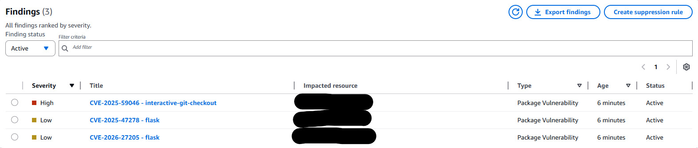
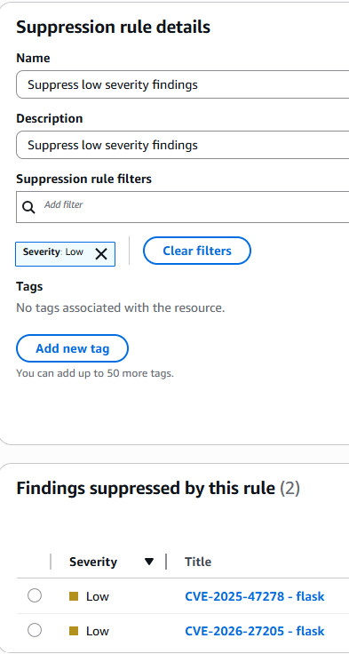

# AWS: Automate Security Checks with Amazon Inspector

## Overview

In this project, we enable Amazon Inspector and use it to perform automated security assessments of AWS resources. Amazon Inspector continuously assesses resources for potential security vulnerabilities, providing detailed findings with severity ratings. We configure Amazon Inspector to scan a pre-configured Amazon EC2 instance, analyze vulnerability findings to understand our overall security posture, and create suppression rules to prioritize security risks based on severity ratings.

---

## Objectives

- Activate and explore Amazon Inspector
- Review and interpret security findings
- Create suppression rules based on finding severity ratings

---

## Task 1: Activate and Explore Amazon Inspector

### Task 1.1: Activate Amazon Inspector

1. On the AWS Management Console, in the search box, search for and choose **Amazon Inspector**.
2. On the Amazon Inspector page, choose **Get Started**.
3. On the Activate Inspector page, choose **Activate this account**.
4. After a moment, a banner is displayed with the message: *"Welcome to Inspector. Your first scan is underway."*

---

### Task 1.2: Review the Amazon Inspector Summary Dashboard

Review the Amazon Inspector Summary Dashboard to understand the security findings and overall security posture of your AWS resources. The dashboard provides a comprehensive overview of security findings across all AWS resources, helping you quickly understand the security status of your EC2 instances.

1. You should automatically be on the dashboard page. If not, in the left navigation pane, choose **Dashboard**.
2. Review the information displayed in the following sections:
   - **Environment coverage**
   - **Critical findings**
   - **Findings with exploit available and fix available**
   - **Risk based remediations**

> **Note:** Since Amazon Inspector was just enabled, it may take a few minutes for results to appear. They will appear automatically, but you can also choose the **Refresh** button to display the latest information.

---

### Task 1.3: Enable Hybrid EC2 Scanning

Configure Amazon Inspector to use hybrid scanning mode, which combines both agent-based and agentless scanning methods to ensure comprehensive coverage of all EC2 instances in the account.

1. In the navigation pane, under **General settings**, choose **EC2 scanning settings**.
2. On the EC2 scan settings page, verify that the scan mode is set to **Hybrid**.
3. If the scan mode is not set to Hybrid, choose the **Edit** button.
4. In the pop-up window, choose **Hybrid**, and select **Save**.

> **What Hybrid means:** Amazon Inspector will use agent-based scanning for all eligible instances managed by AWS Systems Manager (SSM), and agentless scanning using EBS snapshots for instances not managed by SSM.

5. In the navigation pane, under **Resources coverage**, choose **EC2 instances**.
6. In the instances list, review the information associated with your EC2 instance and note that the scan type is **agent-based**.

✅ **Task 1 Complete:** Successfully activated Amazon Inspector and explored its security assessment capabilities by enabling the service, automatically discovering and scanning EC2 instances for potential vulnerabilities, and reviewing the initial security findings.

---

## Task 2: Review and Interpret Amazon Inspector Findings

### Task 2.1: Examine Vulnerability Findings and Severity Ratings

1. In the left navigation pane, choose **Findings**.
2. On the Findings page, look at the **Severity** column and observe the different severity ratings for the vulnerabilities detected.

**Understanding severity ratings:**

| Severity | Description |
|----------|-------------|
| **Critical** | Immediate action required. Pose the highest risk to infrastructure and indicate the most serious vulnerabilities. |
| **High** | Significant security risks that should be addressed quickly. |
| **Medium** | Important vulnerabilities that should be remediated in a timely manner. |
| **Low** | Minor issues that can be addressed during routine maintenance. |

**Amazon Inspector detects the following two vulnerability findings for the EC2 instance:**

| Severity | CVE ID | Package Affected |
|----------|--------|-----------------|
| High | CVE-2025-59046 | interactive-git-checkout |
| Low | CVE-2025-47278 | flask |

3. Choose a specific finding to open a pane displaying its detailed information.
4. In the finding details pane, examine the following key sections:
   - **Finding overview** – Basic information about the vulnerability including severity, type, and fix availability
   - **Affected packages** – Details about the vulnerable software packages and their versions
   - **Vulnerability details** – Technical scoring information, CVE identifiers, and vulnerability classification data
   - **Resource affected** – Information about the AWS resource where the vulnerability was found

5. Under **Vulnerability details**, find the **Vulnerability ID**.
6. Choose the Vulnerability ID link to open the CVE details page on the NVD website:
   - Example: [CVE-2025-59046](https://nvd.nist.gov/vuln/detail/CVE-2025-59046)

> **What is a CVE identifier?**  
> A CVE (Common Vulnerabilities and Exposures) identifier is a standardized, unique code that represents a specific known security vulnerability in software or hardware.  
> - **Format:** `CVE-YEAR-NUMBER` (e.g., `CVE-2025-59046`)  
> - Provides a consistent way to track and reference security vulnerabilities across different platforms  
> - Helps security professionals identify risks, prioritize patches, communicate details, and track vulnerability history

---

### Task 2.2: View Findings by Instance and Apply Filters

1. In the left navigation pane, under **Findings**, choose **By instance**.
2. Select the **instance ID** link to see a detailed breakdown of all findings for that EC2 instance.
3. Choose the **filter criteria** search field to open a dropdown menu.
4. In the dropdown menu, select **Severity** and choose **High**.
5. Choose **Apply**.

You will now see only the findings that match the filter criteria.

✅ **Task 2 Complete:** Successfully reviewed findings, filtered vulnerabilities by severity, and examined detailed security risk information.

---

## Task 3: Create a Suppression Rule and Review Updated Findings

### Task 3.1: Create a Suppression Rule

Create a suppression rule to automatically filter out lower-severity security findings, reducing alert fatigue and allowing your team to focus on high-impact risks.

1. In the left navigation pane, choose **Suppression rules**.
2. In the Suppression rules section, choose **Create rule**.
3. In the **Suppression rule details** section:
   - **Name:** `Suppress low severity findings`
   - **Description:** `Suppress low severity findings`
4. In the **Suppression rule filters** field, choose **Add filter**.
5. In the dropdown menu, select **Severity**.
6. In the severity dropdown, select **Low**, and then choose **Apply**.

> **Note:** By selecting Low severity, you are creating a rule that will automatically suppress low-severity vulnerability findings across your scanned resources.

7. Choose **Save**.
8. Verify that the new suppression rule appears in the Suppression rules list.

> **Note:** By creating this suppression rule, you have configured Amazon Inspector to automatically hide low-severity findings, allowing your security team to focus on more critical vulnerabilities that require immediate attention.

> ⚠️ **Caution:** Creating suppression rules should be done carefully. While this helps reduce noise, ensure that you are not overlooking potentially important security findings, even if they are low severity.

✅ **Task 3.1 Complete:** Successfully created a suppression rule.

---

### Task 3.2: Review Updated Findings

1. In the navigation pane, choose **Findings**.
2. Under **Finding status**, choose the selection field to open a dropdown menu.
3. Select **Suppressed** to view findings suppressed by your rule.
4. Open the dropdown again and select **Show all** to view all findings, including suppressed ones.
5. Open the dropdown again and select **Active** to view only findings that have not been suppressed.
6. Observe the findings list, which now reflects the suppression rule you created.

> **Note:** With the suppression rule in place, you should see a reduction in the number of findings.

> ⚠️ **Caution:** While suppression rules help manage noise, ensure that you do not inadvertently hide critical vulnerabilities that require immediate attention.

✅ **Task 3.2 Complete:** Successfully created a suppression rule in Amazon Inspector to automatically filter out low-severity security findings.

---

## Conclusion

In this project, we:

- ✅ Activated and explored Amazon Inspector
- ✅ Reviewed and interpreted security findings
- ✅ Created suppression rules based on finding severity ratings

---

## Additional Resources

* For more information about Amazon Inspector, see [Amazon Inspector Documentation](https://docs.aws.amazon.com/inspector/latest/user/getting_started_tutorial.html).

